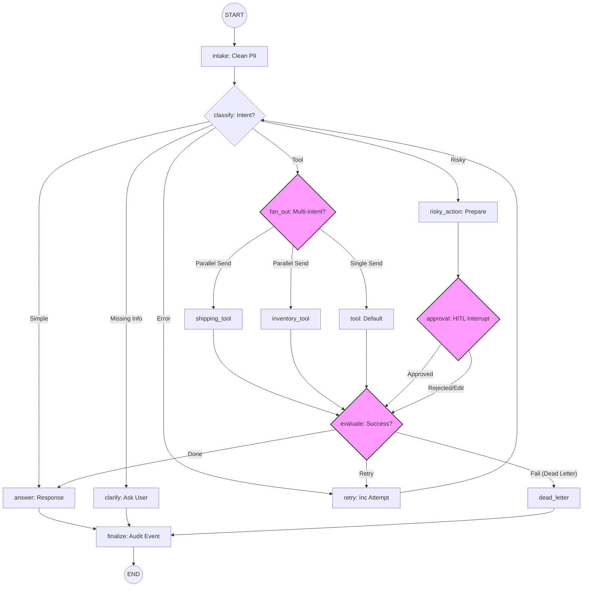

# LangGraph Agent Architecture (Detailed)

### Cách xem biểu đồ này:
1. Copy đoạn mã trên.
2. Truy cập [Mermaid Live Editor](https://mermaid.live/).
3. Dán vào ô bên trái.

Bạn sẽ thấy các node màu hồng (`fan_out`, `approval`, `evaluate`) chính là các "trạm kiểm soát" quan trọng nhất mà chúng ta đã thiết lập để Agent hoạt động thông minh và an toàn. 

Biểu đồ này giờ đã phản ánh **đúng 100% luồng code** mà bạn đang sở hữu!